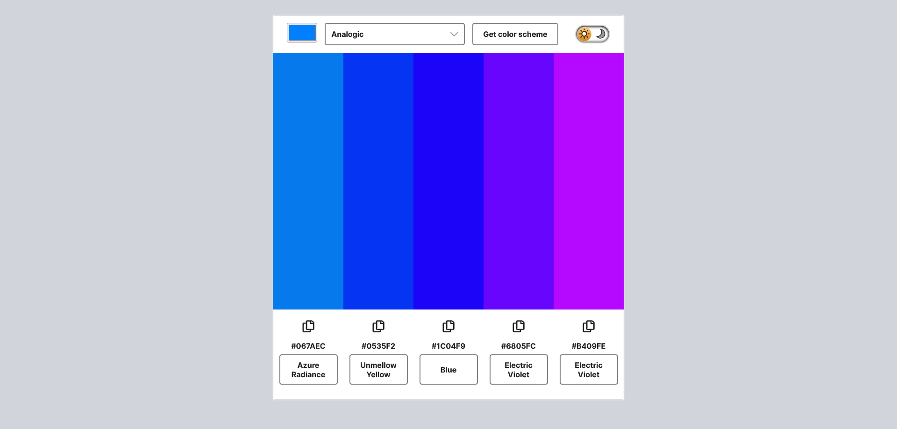
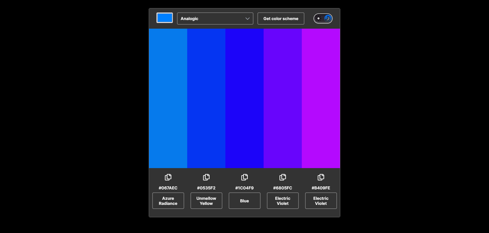
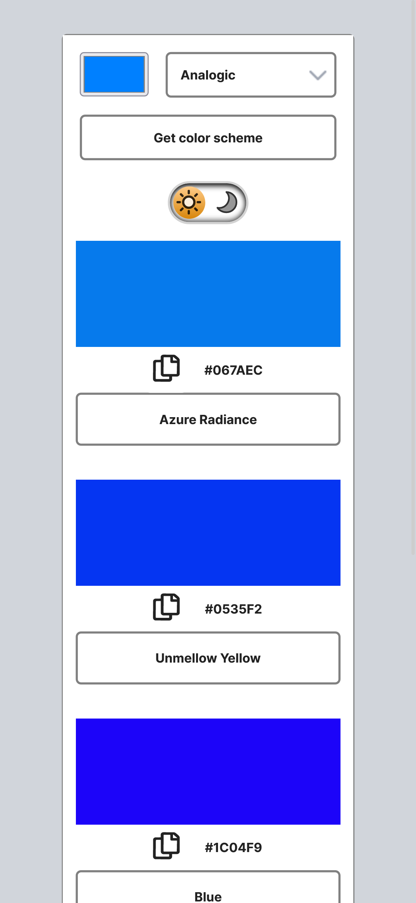
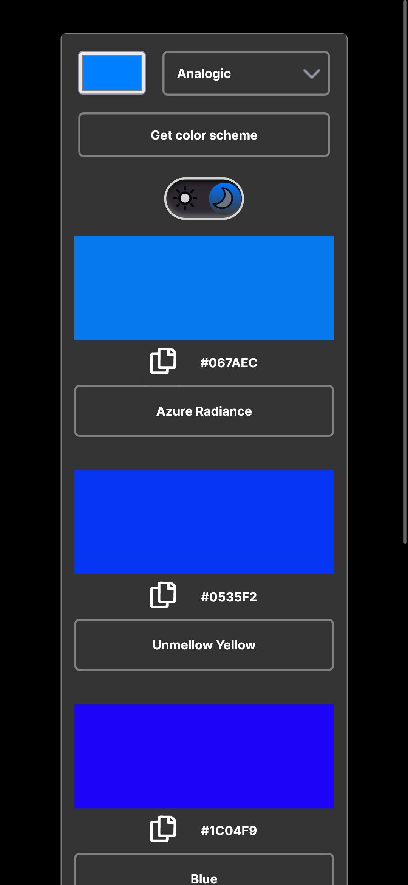

 ## Table of contents

- [Overview](#overview)
  - [The challenge](#the-challenge)
  - [Screenshot](#screenshot)
  - [Links](#links)
- [My process](#my-process)
  - [Built with](#built-with)
  - [What I learned](#what-i-learned)
  - [Continued development](#continued-development)
  - [Useful resources](#useful-resources)
- [Author](#author)
- [Acknowledgments](#acknowledgments)


### Overview

- Scrimba M9 solor project: Color Scheme Generator
- [Scrim](https://scrimba.com/learn/frontend/solo-project-color-scheme-generator-co73343ea8c93c5d396d7ac67)


### The challenge

- Requirements
  - [Color API documentation - schemes section](https://www.thecolorapi.com/docs#schemes)
  - Choose "seed color" with
  ```html
  <input type="color">
  ```
  - Choose color scheme mode in a <select> box, use documentation to see which schemes are available
  - Clicking button makes request to The Color API to get a color scheme
  - Display scheme colors and hex values on the page

- Stretch goal
  - click on hex values and color to copy it to the clipboard

- Personal stretch goal
  - light/dark mode toggle

- [Figma file](https://www.figma.com/file/5Si9YM6QizrS5w2emKomrB/Color-Scheme-Generator-(Copy)?type=design&node-id=0-1&mode=design&t=sE6IeTcjq7kQf1g3-0)

 ### Screenshot

<h2>Desktop - Light Mode</h2>
<hr>



<h2>Desktop - Dark Mode</h2>
<hr>



<h2>Mobile - Light Mode</h2>
<hr>



<h2>Mobile - Dark Mode</h2>
<hr>




### Links

- [Scrim](https://scrimba.com/scrim/co5914dd4aeff9acb0df6d74b)
- [Github](https://github.com/casserole27/color-scheme-generator)
- [Live Site](http://www.clewisdev.com/color-scheme-generator/)

## My process

- Create Github repository
- Set up basic HTML file 
- Set up basic CSS file
- Set up basic JavaScript file
- Consult Figma design files
- Project work
- Publish live URL
- Check markup and accessibility
(https://validator.w3.org/)
(https://wave.webaim.org/)
- README file

### Built with

- HTML5
- CSS custom properties
- Responsive Web Design
- vanilla JavaScript
- Accessibility : added keyboard focus options for copy to clipboard
- REST API : The Color API
- chatGPT
- custom light/darkmode toggle

### What I learned

- Custom select element arrow
```css
select {
    /* Remove default arrow */
    -webkit-appearance: none;
    -moz-appearance: none;
    appearance: none;
    /* Add custom arrow */
    background-image: url(assets/selector.png);
    background-repeat: no-repeat;
    background-position: 96%;
    padding: .75rem;
    border: 2px solid var(--border-color);
    border-radius: 5px;
}
```

- Using inline SVGs inside button tags
```css
svg {
    fill: currentColor;
    pointer-events: none; /*this allows the button to still be in use*/
    width: 40px;
    height: 40px;
}
```
- How to build a search query for a fetch call
- used chatGPT prompts 
```javascript
function getColors() {
        //store user input in variables
        const seedColor = document.getElementById('seed-color').value;
        const colorMode = document.getElementById('color-schemes-select').value;
    
        //create parameters from these variables for search query
        const params = {
            hex: seedColor,
            mode: colorMode
        };
    
        //https://developer.mozilla.org/en-US/docs/Web/API/URLSearchParams
        //construct the query string from the parameters
        //URLSearchParams returns an object instance
        //.toString() method returns a string containing the query string, suitable for use in a URL
        const queryString = new URLSearchParams(params).toString();
    
        //create the url with the query string to pass to fetch
        const url = `https://www.thecolorapi.com/scheme?${queryString}`;
    
        fetch(url)
        .then(response => response.json())
        .then(data => {
            //assign the colors array of objects from the API to colorsArray
            colorsArray = data.colors;  
            renderColors() 
        });
};

```

### Continued development


### Useful resources

-[The Color API documentation](https://www.thecolorapi.com/docs)

-[Create custom select menus](https://www.w3schools.com/howto/howto_custom_select.asp)

## Author

- Website - [C Lewis](https://www.clewisdev.com)
- LinkedIn - [LinkedIn](https://www.linkedin.com/in/clewisdev/)


## Acknowledgments


